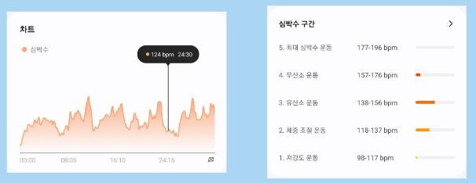

    <h1>❓ 빅데이터의 필요성 ❓</h1>

 

Gunpang에서는 운동 시 심박수 데이터를 모아 저강도, 중강도, 고강도 운동을 각각 몇 분씩 진행하였는지 제공한다.

    

wearOS 기기에서 운동을 시작하면 **1초에 1개 씩** 심박수 데이터를 수집한다.  
100명의 사용자가 1시간 씩 운동한다고 가정했을 때 **하루**에만 **360,000**개의 데이터가 발생한다.

많은 양의 데이터를 처리하기 위해 Hadoop을 도입하였다.

    <h1>🛠️ 기술 스택 🛠️</h1>

 

## Kafka
다음과 같은 이유로 Kafka를 도입하였다.

- **비동조(Decoupling)**
Kafka를 워치와 hadoop 사이에 두어 연결을 느슨하게 한다.
- **탄력성(Resilience)**
작업의 일부가 실패하여도, 전체에는 영향이 미비하다.

## Hadoop
고성능의 서버 하나 대신 **보통 성능의 서버**를 **여러 대** 두어 분산 환경에서 데이터를 저장하고 처리한다.

Gunpang의 경우 **총 3대**의 서버를 두어 처리하였다.
- masternode 2대
- datanode 1대

    <h1>🖇️ 빅데이터 처리 과정 🖇️</h1>

 

    

## wearOS 기기 🠖 Kafka
스마트 워치와 Kafka는 spring 서버를 통해 통신한다.

1. 워치에서 발생한 데이터는 **socket 통신**을 통해 spring 서버에 들어온다.
2. spring 서버에서는 수신한 데이터를 **kafka-raw-topic**에 **produce**한다.

자세한 코드는 [heart-service-produce](https://github.com/Gunpang-galaxy/gunpang-bigdata/tree/master/heart-service-produce)에서 확인할 수 있다.

## Kafka 🠖 Hadoop
Kafka으로 유입된 데이터는 Spark를 통해 Hadoop에 적재된다.

Spark에서는 다음과 같은 로직을 통해 처리된다.
1. Kafka의 데이터를 **Dataframe**의 형태로 읽어 온다.
2. 사용자 정보, 심박수, 심박수 측정 시간의 데이터 형태에 맞추어 **parsing**한다.
3. Hadoop의 **/user/hadoop/heartrate 경로**에 데이터를 적재한다.

자세한 코드는 [kafka_to_hadoop](https://github.com/Gunpang-galaxy/gunpang-bigdata/blob/master/kafka_to_hadoop.py)에서 확인할 수 있다.

    <h1>📈 추후 개선 방안 📈</h1>

 

## 현재 처리 과정의 문제점
사용자가 운동 정보를 클릭하면 저·중·고강도 운동의 지속 시간만을 보여준다.  
하지만 사용자가 운동 완료 시, Hadoop에 저장된 해당 날짜의 **모든 운동 기록**(사용자 정보, 심박수, 심박수 측정 시간)을 **반환**한다.

## 개선 방안
Hadoop에 저장된 모든 기록을 필요로 하는 기능을 추가할 예정이라 모든 데이터를 반환하도록 하였다.  
추후 **비슷한 운동 목표**를 가진 사용자 중 **체성분이 크게 개선**된 사용자의 운동 스타일을 분석하여 제공하려고 한다.

    

